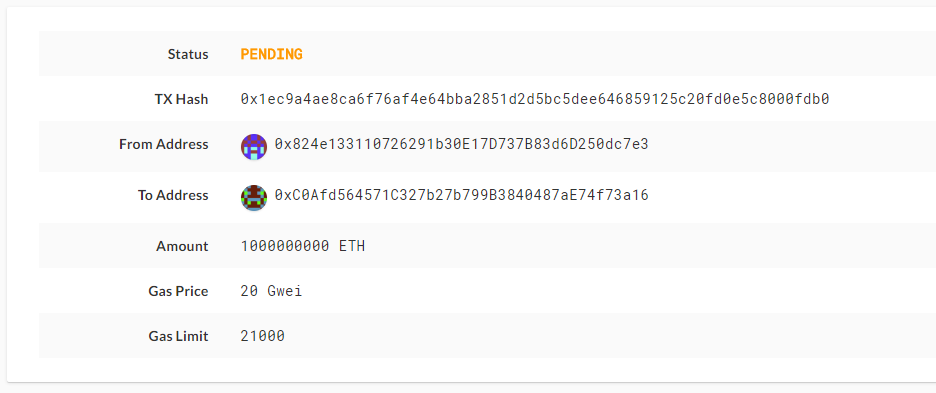

# Creating the hw_zbank_testnet Network
## Creating a mining network: 
1. Open Geth in terminal: Geth
1. Run though the code in "create_nodes_code.txt"
1. 1st flag - name network: hw_zbank_testnet
1. 2nd flag - select #2 Configure new genesis
1. 3rd flag - select #1 Create new genesis from scratch
1. 4th flag - select #2 Clique - proof of authority
1. 5the flag - "How many seconds should blocks take?": hit Enter (ignore)
1. 6th flag - accounts allowed to seal: enter addresses of node1_hw_zbank_testnet and node2_hw_zbank_testnet
1. 7th flag - accounts to pre-fund: enter the same addresses as the 6th flag
1. 8th flag - should prefund?: no
1. 9th flag - select a network id: 40343
1. Result should be "Configured new genesis block"
1. Next select #2 Manage existing
1. Select #2 Export genesis configurations
1. Save to current directory Geth/hw_zbank_testnet

## Initializing Nodes and Mining 
1. Open a new terminal (git bash on Windows) 
1. Install Geth: pip install geth
1. Run through the code in "node1_code.txt"
1. Open a new terminal
1. Run through the code in "node2_code.txt"

## MyCrypto Setup
1. Open MyCrypto
1. Select "View and Send"
1. Select "Ketstore File"
1. Import the kestore file within node1_hw_zbank_testnet/keystore
1. You can do the same with node2...
1. Select "Change Network"
1. Select "Add Custom Node"
1. Select "Network" and choose "Custom"
1. Node Name is "hw_zbank_testnet"
1. URL is https://127.0.0.1:8545/
1. Currency is "ETH"
1. Chain is "40343"

## Sending Crypto Currency
1. From Node1 enter address of Node2 within "View & Send" > "To Address"
1. Select "Send Transaction"
1. When prompted select "TX Status"

